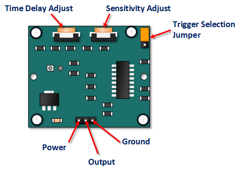
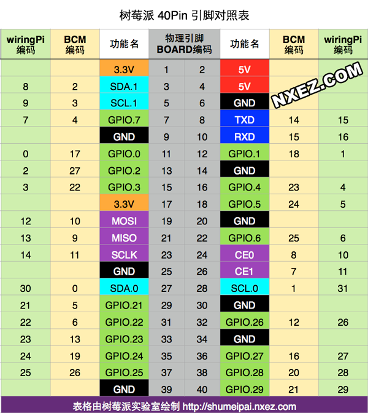
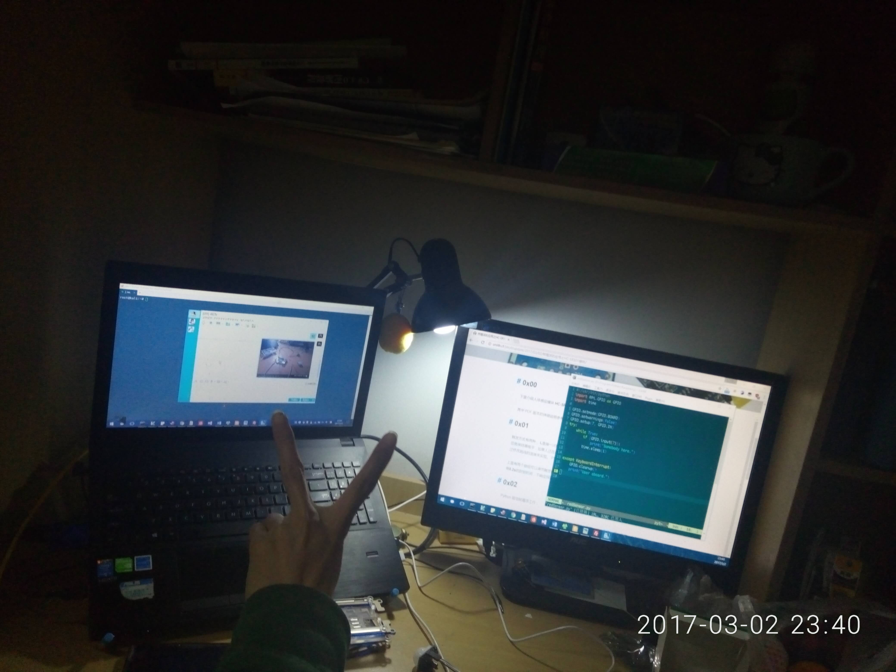
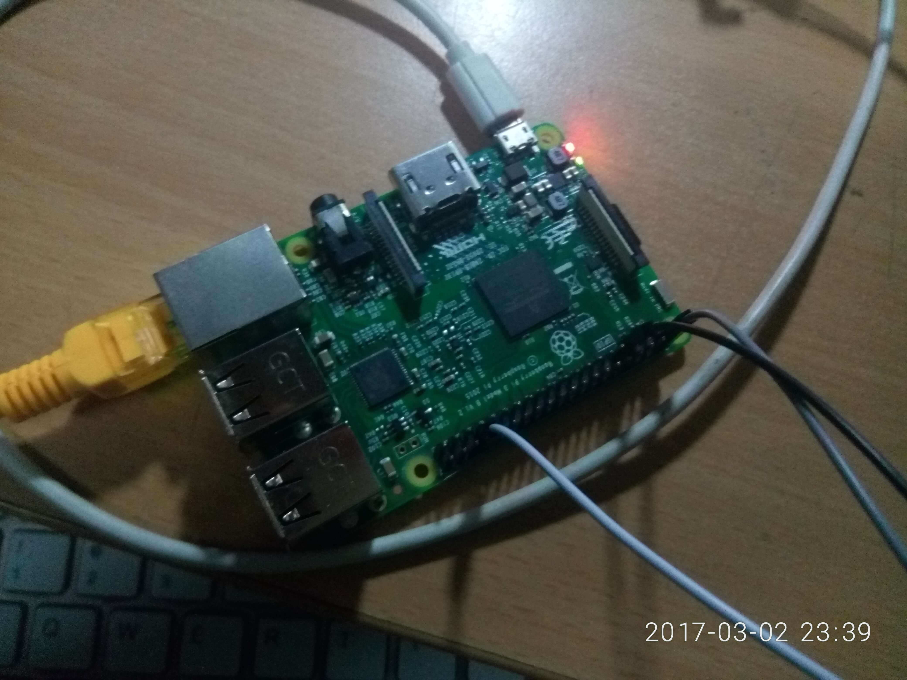

## 0x00 
下面介绍人体感应模块 **HC-SR501**。

其中 PDF 版本的详细说明参考 [在这里](https://www.mpja.com/download/31227sc.pdf)， 本文参考于 [arduino](https://lastminuteengineers.com/pir-sensor-arduino-tutorial/)

## 0x01

PS: 图片来自一个国外友人的 [博客](https://lastminuteengineers.com/pir-sensor-arduino-tutorial/)
触发方式有两种， **L**是指一次触发之后就保持高电平到一个周期末，然后停止。**H**是指一次触发之后就保持高电平，如果人还在感应范围内就保持高电平不变化直到人离开感应范围。更改触发方式通过修改跳线的连接来实现。
PS:感应的时候输出高电平。

上面有两个旋钮可以调节触发的灵敏度和触发的探测距离，距离在 **7m**以内。
在输出高电平之后会有**0.2s**的封锁时间，不响应探测。

## 0x02
Python 驱动树莓派工作：
* 树莓派的GPIO口的编号有两种方式，一种是按照从左到右，从上到下。开始的第一个引脚叫做 `pin 1`，最后一个叫做 `pin 40`。 这种编号方式叫做 **BOARD**, 另外一种方式是按照每个引脚的功能来的，叫做**BCM**。


PS: 图片出处见水印
* 在代码开始前需要通过 `GPIO.setmode(GPIO.BCM)`来声明你是怎样使用它的引脚的。我偏向于**BOARD**这种方式，因为简单粗暴。
* 如果GPIO在另外一个脚本里面使用了，那么他会出警告，我们可以设置一下`GPIO.setwarings(False)`来禁用他。
* 我们 需要制定用到的每一个引脚的功能，酱紫 `GPIO.setup(17, GPIO.IN)`, 其中17是引脚的BCM编号，或者酱紫 `GPIO.setup(17, GPIO.OUT, initial=GPIO.HIGH)`，其中最后的**initial=GPIO.HIGH**缺省，用来指定引脚的初始的电平。
* 读取引脚的状态可以 `GPIO.input(17)`， 返回值是 `0,1,GPIO.LOW, GPIO.HIGH, True, False`
* 设置引脚的输出状态可以酱紫 `GPIO.output(17,GPIO.HIGH)`.
* 脚本结束后务必清理一下GPIO的状态为输入，避免短路`GPIO.cleanup()`

* 把 HC-SR501的有引脚的那面靠近自己，灵敏度调节的朝上，那么左边的那个引脚是 VCC，右边的是 GND， 中间的是OUTPUT


## 0x03
这次试验中我用的**BOARD**方式编码的**7**号引脚，GND接的34号，VCC接的2号。参考的官方给的PDF，模块需要的电压是`5v-20v`
## 0x04
我写的python 代码如下,很简短，不过是我第一次尝试这个模块：
```python
#!/usr/bin/python
import RPi.GPIO as GPIO
import time

GPIO.setmode(GPIO.BOARD)
GPIO.setwarnings(False)
GPIO.setup(7, GPIO.IN)  # Here I use Pin 7 connect to OUTPUT of the sensor.
try:
	print("Init....")
    while True:
        if (GPIO.input(7)):
            print("Somebody here.")
        time.sleep(1)

except KeyboardInterrupt:       #capture the Ctrl+c， before it exit, I clean the GPIO
    GPIO.cleanup()
    print("User aboard.")

```

## 0x05
后记：
这个模块很不稳，输出不止探测到人，也会出错，对着我的脸的时候不停的给信号，说明探测断断续续，我是把他放置到L模式，他是探测到人就持续输出高电平，探测不到就低电平。
模块是探测指定波段的红外线，这个波段的红外线主要是人类的体温发出的波段，如果将菲涅尔透镜朝向温度和人体差不多的东西，比如我正在工作的显示器，他也会以为那里有人，从而发出高电平。
附上两张工作的照片。

以及树莓派的照片

